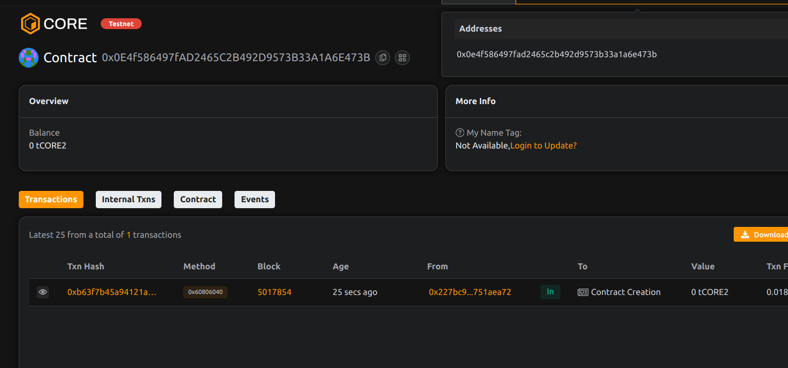

# Project Title: CarbonBurn: Offset Credits with Proof-of-Burn manoj ahirwar  

## Project Description        

CarbonBurn is a smart contract for offsetting carbon emissions through ETH burns. Users submit proof-of-impact (e.g. on-chain or off-chain hashes) and burn ETH to offset their footprint.
    
## Project Vision     
 
To offer a transparent, immutable and publicly auditable mechanism for climate action through crypto-native mechanisms like burn proofs.

## Key Features          
   

- ETH burn as proof-of-offset
- Hash-linked verification for claimable carbon proofs
- Anti-duplication via hash checks
- Public ledger of individual offset amounts

## Future Scope

- Issue NFTs or SBTs as offset certificates
- Integrate real-time carbon tracking APIs
- DAO-managed offset fund and grants
- Tokenization of carbon credits on-chain

## Contract Details 
0x0E4f586497fAD2465C2B492D9573B33A1A6E473B     
   
